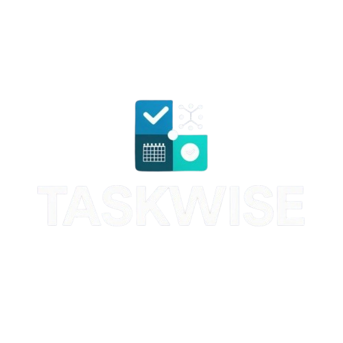

<div align="center">
  
  
  # TaskWise
  
  **AI-Powered Productivity & Task Management**
  
  TaskWise is a modern, intelligent task management application designed to help you organize your life, plan your studies, and boost productivity using the power of AI.
</div>

---

## 🚀 Features

### 🤖 AI Assistant
- **Smart Planning**: Generate comprehensive study plans or daily schedules just by chatting.
- **Natural Language Tasks**: Add tasks using natural language (e.g., "Remind me to submit the report tomorrow at 2 PM").
- **Interactive Chat**: Brainstorm ideas, ask questions, and get productivity advice.

### 📅 Smart Calendar
- **Multiple Views**: Switch between Day, Week, and Month views.
- **Time Blocking**: Visualize your day with precise time slots.
- **Drag & Drop**: Easily manage your schedule (coming soon).

### ✅ Task Management
- **Today's Focus**: A dedicated view for what matters most right now.
- **Smart Filtering**: Filter by Date (Today, Tomorrow, Week), Priority, or Category.
- **Quick Actions**: Edit, delete, or complete tasks with a single click.

### 📊 Analytics & Insights
- **Productivity Stats**: Track your completion rates and focus streaks.
- **Visual Progress**: See your achievements over time.

### 🎨 Modern UI/UX
- **Dark Mode**: Sleek, eye-friendly dark theme.
- **Responsive Design**: Works seamlessly on desktop and mobile.
- **Customizable**: Personalize your experience.

---

## 🛠️ Tech Stack

- **Frontend**: React.js, Vite
- **Styling**: Tailwind CSS, Framer Motion
- **Backend / Auth**: Firebase (Firestore, Authentication)
- **AI Integration**: Together AI (Mixtral-8x7B)
- **Icons**: Material Symbols

---

## 🏁 Getting Started

### Prerequisites
- Node.js (v16 or higher)
- npm or yarn

### Installation

1. **Clone the repository**
   ```bash
   git clone https://github.com/yourusername/taskwise.git
   cd taskwise
   ```

2. **Install dependencies**
   ```bash
   npm install
   ```

3. **Environment Setup**
   Create a `.env` file in the root directory and add your API keys:
   ```env
   VITE_FIREBASE_API_KEY=your_firebase_key
   VITE_TOGETHER_API_KEY=your_together_ai_key
   ...
   ```

4. **Run the development server**
   ```bash
   npm run dev
   ```

---

## 📱 Screenshots

*(Add screenshots of your Dashboard, Calendar, and AI Chat here)*

---

## 📄 License

This project is licensed under the MIT License - see the [LICENSE](LICENSE) file for details.

<div align="center">
  <p>Built with ❤️ by Segun</p>
</div>
